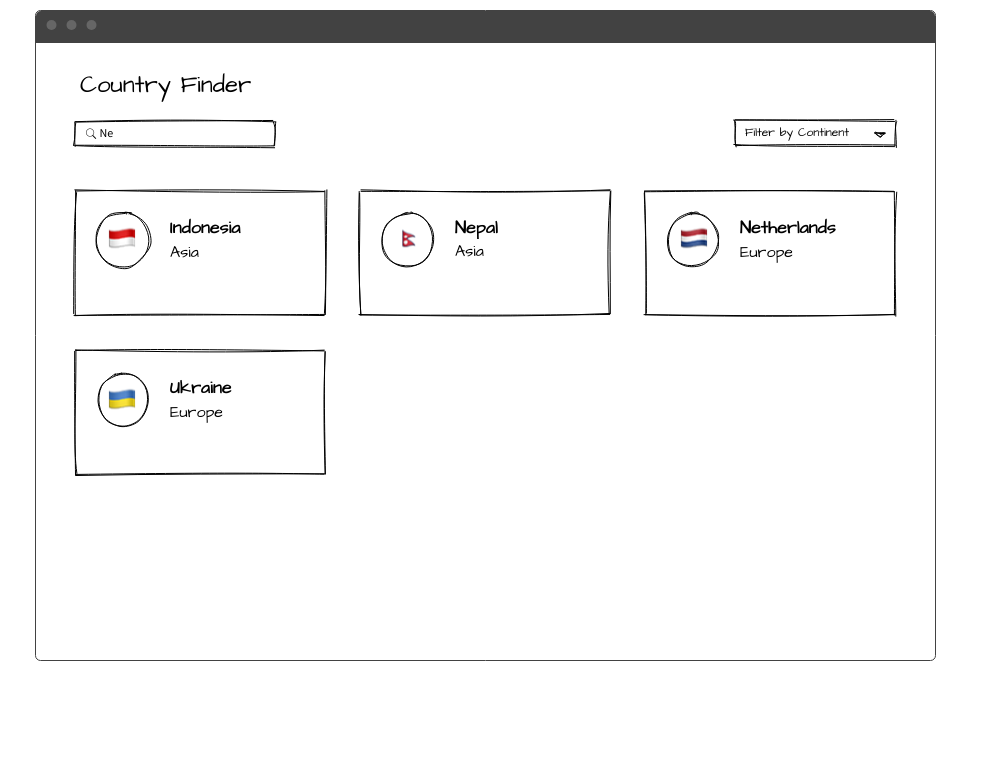

# Gigaclear Frontend Code Challenge

This document contains instructions for candidates to follow as part of the Gigaclear Frontend Code Challenge. We look forward to your submission.

## Stack

- _TypeScript_
- _React.js_
- _Tailwind CSS_ for styling
- _Jest/React-testing-library_ for tests

Please use libraries from the above list, If you like to add other libraries you have the freedom to add them as long as you can explain the reason for adding them.

## Instructions

Please complete the steps below and create an app based on the wireframe provided.

1. Please make a Code Review of _Continents.tsx_ and _Continents.test.tsx_. Create file _CODEREVIEW.md_ and put your thoughts inside.
2. Fix test in _Continents.test.tsx_.
3. Remove _Continents_ component from _App.tsx_.
4. Implement the core functionality listed below.
5. Include tests for your code.

## Wireframe

## Functionality

App will load and display data for countries from [this public Countries GraphQL API](https://countries.trevorblades.com).

- User can search for a country
- User can filter countries by continents
- User can click on a country to see more information of the selected country.
- User can "go back" after selecting a specific country.

## Submitting your code

- Please submit your code using GitHub or other git hosting service.
- Include any instructions required to run the app in the _README_ file.
- Bonus point for deploying it to Vercel/Netlify etc, and providing a preview link.

## Finally

Good luck and have fun with this challenge! 💪
